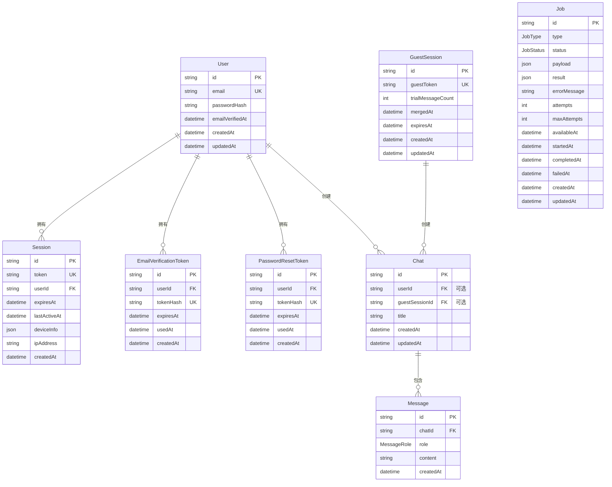

# AI Chat 项目核心概念图文详解

> 用通俗的方式解释项目的所有重难点

---

## 目录

1. [Entry State System - 入口状态系统](#1-entry-state-system)
2. [Auth System - 认证系统](#2-auth-system)
3. [Guest System - 游客系统](#3-guest-system)
4. [Chat System - 聊天系统](#4-chat-system)
5. [Streaming Response - 流式响应](#5-streaming-response)
6. [Error Handling - 错误处理](#6-error-handling)
7. [Rate Limiting - 限流系统](#7-rate-limiting)
8. [Cache Service - 缓存服务](#8-cache-service)
9. [Async Queue - 异步任务队列](#9-async-queue)
10. [Pagination - 游标分页](#10-pagination)
11. [Transaction - 数据库事务](#11-transaction)
12. [数据库 ER 图](#12-数据库-er-图)

---

## 1. Entry State System

### 核心理念：统一的用户状态入口

```
用户访问任何页面
       │
       ▼
┌──────────────────┐
│  resolveEntryState │  ← 根据 Cookie 判断当前状态
└────────┬─────────┘
         │
    ┌────┴────┬────────┬────────┬────────┐
    ▼         ▼        ▼        ▼        ▼
  预览     游客试用    已登出   未验证    已验证
  状态      工作区     状态    用户      用户
```

### 五种状态详解

| 状态                         | Cookie                       | 含义               | 能做什么         |
| ---------------------------- | ---------------------------- | ------------------ | ---------------- |
| `signed_out_guest_preview`   | 无 Cookie                    | 首次访问，预览模式 | 看首页，不能聊天 |
| `signed_out_guest_workspace` | guest_token                  | 游客试用中         | 可发 3 条消息    |
| `signed_out_auth_shell`      | auth_shell=1                 | 主动登出           | 只能看登录页     |
| `authenticated_unverified`   | session_token + email 未验证 | 注册但未验证邮箱   | 可以访问基础功能 |
| `authenticated_verified`     | session_token + email 已验证 | 正常登录用户       | 全部功能         |

### 决策流程图

```
                    ┌─────────────┐
                    │   请求进入   │
                    └──────┬──────┘
                           │
                    ┌──────▼──────┐
                    │ 有 session？ │
                    └──────┬──────┘
                      ┌────┴────┐
                     是          否
                      │          │
                      ▼          ▼
              ┌──────────┐  ┌──────────┐
              │邮箱已验证？│  │有 auth_  │
              └────┬─────┘  │shell？   │
            ┌────┴────┐     └────┬─────┘
           是          否        是      否
            │          │         │       │
            ▼          ▼         ▼       ▼
      verified   unverified  auth_  guest_
                             shell  preview
```

### 代码位置

`src/server/auth/entry-state.ts`

---

## 2. Auth System

### 三层架构

```
┌─────────────────────────────────────────────┐
│          API Route (entry point)            │
│  /api/auth/login, /api/auth/register, etc   │
└────────────────────┬────────────────────────┘
                     │
                     ▼
┌─────────────────────────────────────────────┐
│         Service Layer (business logic)      │
│  - loginUser()                              │
│  - registerUser()                           │
│  - changePasswordForUser()                  │
└────────────────────┬────────────────────────┘
                     │
                     ▼
┌─────────────────────────────────────────────┐
│       Repository Layer (data access)        │
│  - findUserByEmail()                        │
│  - createSession()                          │
│  - updatePasswordHash()                     │
└────────────────────┬────────────────────────┘
                     │
                     ▼
              ┌──────────────┐
              │   Prisma/DB   │
              └──────────────┘
```

### Session 设计：Cookie 只存 Token

```
┌─────────────────────────────────────────────────┐
│                    浏览器                        │
│  Cookie: ai-chat-session=550e8400-e29b-41d4... │
│  ↑ 只存一个随机 UUID，不存任何用户信息           │
└────────────────────┬────────────────────────────┘
                     │
                     ▼ 每次请求带上 token
┌─────────────────────────────────────────────────┐
│                    服务器                        │
│  1. 从 Cookie 读取 token                        │
│  2. 用 token 查数据库 → Session 表              │
│  3. Session.userId → User 表                    │
│  4. 返回完整用户信息                             │
└─────────────────────────────────────────────────┘
```

### 为什么这样设计？

```
❌ 不推荐：Cookie 直接存用户信息
{
  "userId": "123",
  "email": "user@example.com",
  "role": "admin"
}
问题：用户改密码后，Cookie 还是有效的！

✅ 推荐：Cookie 只存不透明 Token
ai-chat-session=550e8400-e29b-41d4...
优点：
- 改密码 = 删所有 Session，其他设备自动登出
- 用户信息变了，下次请求自动查到最新
- Token 泄露可以单独撤销，不影响其他设备
```

### Session 数据结构

```
Session 表
├── id (UUID)          ← 主键
├── token (UUID)       ← Cookie 里存的这个
├── userId             ← 关联用户
├── expiresAt          ← 7天后过期
├── lastActiveAt       ← 每次请求更新
├── ipAddress          ← 登录时的 IP
└── deviceInfo (JSON)  ← 设备信息
    ├── type: "desktop" | "mobile" | "tablet"
    ├── browser: "Chrome" | "Safari" | ...
    └── os: "iOS" | "Android" | "macOS" | ...
```

### 多设备管理

```
用户 A 有 3 个设备登录
┌──────────────────────────────────────┐
│         User: user@example.com       │
├──────────────────────────────────────┤
│ 📱 iPhone (Safari)    2分钟前        │
│ 💻 MacBook (Chrome)  1小时前         │
│ 🖥️ Windows PC (Edge)  昨天           │
└──────────────────────────────────────┘

改密码操作：
→ 删除这 3 个 Session
→ 所有设备需要重新登录
```

### 代码位置

- Service: `src/server/auth/auth-service.ts`
- Repository: `src/server/auth/auth-repository.ts`
- Session: `src/server/auth/session.ts`

---

## 3. Guest System

### 核心概念：游客试用

```
未登录用户访问
       │
       ▼
┌──────────────────────┐
│ 创建 GuestSession    │
│ guestToken = UUID    │  ← 存在 Cookie 里
│ trialMessageCount = 0│
└──────────┬───────────┘
           │
           ▼
┌──────────────────────┐
│  用户可以发消息       │
│  每发一条 +1         │
│  最多发 3 条         │
└──────────┬───────────┘
           │
           ▼
┌──────────────────────┐
│  第 4 条被拦截       │
│  提示"请先注册"      │
└──────────────────────┘
```

### GuestSession 数据结构

```
GuestSession 表
├── id
├── guestToken (UUID)       ← Cookie 里存的
├── trialMessageCount       ← 已发消息数
├── mergedAt                ← 注册后合并时间
└── expiresAt               ← 7天后过期
```

### 游客 → 用户 合并流程

```
用户注册前
┌─────────────────┐       ┌─────────────────┐
│  GuestSession   │───────│     Chat 1      │
│  guestToken:ABC │       │     Chat 2      │
│  count: 2       │       │     Chat 3      │
└─────────────────┘       └─────────────────┘
                                       │
                                       │ guestSessionId
                                       ▼

用户注册后
┌─────────────────┐       ┌─────────────────┐
│     User        │───────│     Chat 1      │
│  userId:123     │       │     Chat 2      │
│                 │       │     Chat 3      │
└─────────────────┘       └─────────────────┘
         │                         │
         └─────────────────────────┘
                  userId

GuestSession.mergedAt = 2024-01-01 (标记已合并)
```

### 为什么可以合并？

数据库设计：Chat 表的 `userId` 和 `guestSessionId` 是 **XOR 约束**

```sql
-- Chat 表结构
Chat {
  userId          String?   ← 要么有这个
  guestSessionId  String?   ← 要么有这个
  CHECK (
    (userId IS NOT NULL AND guestSessionId IS NULL) OR
    (userId IS NULL AND guestSessionId IS NOT NULL)
  )
}
```

这样一条 Chat 只能属于"用户"或"游客"其中一个，不能同时有两个。

### 代码位置

- `src/server/guest/guest-service.ts`
- `src/server/guest/guest-repository.ts`

---

## 4. Chat System

### XOR 约束的深层理解

```
每条 Chat 必须有且只有一个主人：

userId        guestSessionId     主人
─────────────────────────────────────────
null          null         ❌ 错误：没有主人
"123"         null         ✅ 用户 123
null          "abc"        ✅ 游客 abc
"123"         "abc"        ❌ 错误：不能有两个主人
```

### Chat → Message 一对多

```
Chat (id: "chat-1")
├── Message 1: { role: "user", content: "你好" }
├── Message 2: { role: "assistant", content: "你好！有什么可以帮你的？" }
├── Message 3: { role: "user", content: "今天天气怎么样？" }
└── Message 4: { role: "assistant", content: "..." }

数据库索引：[chatId, createdAt]
→ 保证消息按时间顺序查询
```

### ChatOwner 类型系统

```typescript
type ChatOwner =
  | { kind: "user"; userId: string }
  | { kind: "guest"; guestSessionId: string };

// 使用时
if (owner.kind === "user") {
  // 用户逻辑：查 userId，检查限流等
} else {
  // 游客逻辑：查 guestSessionId，检查试用额度
}
```

### 代码位置

- `src/server/chat/chat-repository.ts`
- `src/server/chat/chat-types.ts`

---

## 5. Streaming Response

### 传统方式 vs 流式

```
❌ 传统方式：
用户请求 → 服务器处理 → 等待全部完成 → 一次性返回
         ←──────────────────────────────── 5秒
         用户看到加载圈... 5秒 ...

✅ 流式方式：
用户请求 → 服务器处理 → 边生成边返回
         ←── 你 ←── 好 ←── ！ ←── 有 ←── 什 ←── 么 ←── ...
         用户立刻看到文字逐字出现
```

### 技术实现

```
┌─────────────────────────────────────────────────┐
│                     后端                         │
│                                                  │
│  async function* streamChat() {                 │
│    const stream = openai.chat.completions...   │
│    for await (const chunk of stream) {          │
│      yield chunk;  ← 一个字一个字吐出来          │
│    }                                            │
│  }                                              │
│                                                  │
│  return new Response(ReadableStream({...}))     │
└────────────────────┬────────────────────────────┘
                     │
                     │ SSE / Raw Stream
                     ▼
┌─────────────────────────────────────────────────┐
│                     前端                         │
│                                                  │
│  const reader = response.body.getReader();      │
│  while (true) {                                 │
│    const { done, value } = await reader.read(); │
│    if (done) break;                             │
│    appendToChat(value);  ← 逐字显示             │
│  }                                              │
└─────────────────────────────────────────────────┘
```

### 如何获取新生成的 Chat ID？

```typescript
// 前端无法从流式响应中解析 JSON
// 所以用 HTTP Header 传递

Response Headers:
  X-Chat-Id: chat-123  ← 前端从这里拿到新聊天 ID
  Content-Type: text/plain; charset=utf-8

Body: "你好！有什么可以帮你的？"  ← 流式内容
```

### 同时落库

```typescript
// 流式输出时，同时积累完整内容
let assistantReply = "";
for await (const delta of replyStream) {
  assistantReply += delta;
  controller.enqueue(encoder.encode(delta)); // 发给前端
}

// 流完了，存数据库
await createMessage({
  chatId,
  role: "assistant",
  content: assistantReply,
});
```

### 代码位置

`src/server/chat/chat-stream.ts`

---

## 6. Error Handling

### 统一错误基类

```
                 AppError
                    │
        ┌───────────┼───────────┐
        ▼           ▼           ▼
    AuthError    ChatError   ValidationError
        │           │
    ┌───┴───┐   ┌───┴───┐
    ▼       ▼   ▼       ▼
密码错误  未登录  未授权  聊天不存在
```

### 错误 → HTTP 响应

```typescript
// route.ts
try {
  const result = await loginUser(...);
  return NextResponse.json(result);
} catch (error) {
  // 统一转换
  return toErrorResponse(error, {
    fallbackMessage: "Login failed"
  });
}

// 输出
{
  "code": "INVALID_CREDENTIALS",
  "message": "邮箱或密码错误",
  "details": { ... }
}
```

### 错误分类

| 错误类型                  | HTTP Code | 场景                         |
| ------------------------- | --------- | ---------------------------- |
| `InvalidCredentialsError` | 401       | 密码错误                     |
| `UnauthorizedError`       | 401       | 未登录访问受保护资源         |
| `ForbiddenError`          | 403       | 无权限访问（如访问他人聊天） |
| `NotFoundError`           | 404       | 资源不存在                   |
| `RateLimitExceededError`  | 429       | 触发限流                     |
| `ValidationError`         | 400       | 请求参数错误                 |

### 代码位置

`src/server/shared/errors/app-error.ts`

---

## 7. Rate Limiting

### 令牌桶算法 (Token Bucket)

```
┌─────────────────────────────────────┐
│         令牌桶 (capacity: 3)        │
│                                     │
│   [🎫] [🎫] [🎫]  ← 桶里最多 3 张票  │
│                                     │
│   每分钟补充 3 张票                 │
└─────────────────────────────────────┘

时间     tokens 状态        请求      结果
─────────────────────────────────────────────
12:00   [🎫][🎫][🎫]  3张    登录     ✅ 通过，剩2张
12:00   [🎫][🎫]      2张    登录     ✅ 通过，剩1张
12:00   [🎫]          1张    登录     ✅ 通过，剩0张
12:00   []            0张    登录     ❌ 被拦，等58秒

12:01   [🎫][🎫][🎫]  3张    登录     ✅ 满血复活
```

### Redis 存储格式

```bash
# Key 格式
{keyPrefix}:{subject}

# 登录 IP 限流
auth:login:ip:192.168.1.100

# 登录邮箱限流
auth:login:email:user@example.com

# Value (JSON)
{"lastRefillAt": 1712817600000, "tokens": 2.5}
# ↑ tokens 可以是小数，实现平滑限流
```

### 双重限流

```
登录请求同时检查两个维度：

IP 限流 (滑动窗口)
├── 10次/小时
├── 防同一 IP 疯狂试多个账号
└── key: auth:login:ip:{ip}

邮箱限流 (令牌桶)
├── 3次/分钟
├── 防单个账号被暴力破解
└── key: auth:login:email:{email}
```

### 代码位置

`src/server/rate-limit/`

---

## 8. Cache Service

### Cache-Aside 模式

```
┌─────────────────────────────────────────────────┐
│                  读取流程                        │
└─────────────────────────────────────────────────┘

     请求
      │
      ▼
┌─────────┐  miss    ┌─────────┐
│  Cache  │─────────▶│ Database │
└────┬────┘          └─────────┘
     │                      │
     │ hit                 │ 返回数据
     │                      │
     ▼                      ▼
  返回缓存          写入 Cache (下次用)
```

### 降级策略

```
┌─────────────────────────────────────────────────┐
│                 服务可用性保证                    │
└─────────────────────────────────────────────────┘

正常情况：
Redis 可用 → 读缓存 → 命中返回 / miss 查库并回写

Redis 挂了：
自动降级 → 走数据库 → 不报错，业务继续

代码实现：
try {
  return await redis.get(key);
} catch {
  // 静默忽略，走数据库
  return null;
}
```

### 缓存失效策略

```
主动失效 (优于等 TTL 过期)：

用户改密码
  │
  ├─ 更新数据库密码
  ├─ 删除所有 Session
  └─ 删除缓存 ← 马上生效，不等 5 分钟 TTL

用户登出
  │
  ├─ 删除 Session
  └─ 删除缓存 ← 马上失效
```

### 当前缓存点

| 缓存 Key          | TTL    | 失效时机             |
| ----------------- | ------ | -------------------- |
| `session:{token}` | 5 分钟 | 登出/改密码/撤销会话 |

### 代码位置

`src/server/cache/cache-service.ts`

---

## 9. Async Queue

### 为什么需要异步队列？

```
❌ 同步发送邮件：
用户注册 → 请求API → 创建用户 → 发送验证邮件 → 等待SMTP → 返回响应
                                                    ←──────── 2-5秒 ────────
问题：用户等待太久，体验差

✅ 异步发送邮件：
用户注册 → 请求API → 创建用户 → 加入队列 → 立即返回
                                    ↓
                            后台Worker处理发送
用户秒收到响应，邮件慢慢发
```

### 架构设计：双层存储

```
┌─────────────────────────────────────────────────────────────────┐
│                        异步队列系统架构                           │
└─────────────────────────────────────────────────────────────────┘

生产者端 (API Route)              消费者端 (Worker Process)
┌──────────────────┐              ┌──────────────────┐
│   enqueueJob()   │              │   WorkerRunner   │
│   "发邮件给用户"  │              │   轮询队列        │
└────────┬─────────┘              └────────┬─────────┘
         │                                   │
         │ 1. 写数据库                        │ 2. 从Redis弹出
         ▼                                   ▼
┌──────────────────┐              ┌──────────────────┐
│   Job 表         │              │   Redis Queue    │
│   id: job-123    │◄────────────►│   LPUSH/BRPOP    │
│   status: PENDING│  3. Push ID  │   阻塞式弹出      │
│   payload: {...} │              └──────────────────┘
└──────────────────┘
         │
         │ 4. 查询Job详情
         ▼
┌──────────────────┐
│   EmailHandler   │
│   handle()       │
│   发送邮件 ✅     │
└──────────────────┘
         │
         ▼
┌──────────────────┐
│   更新状态        │
│   COMPLETED      │
└──────────────────┘
```

### 为什么用 Redis + 数据库？

| 存储层 | 作用                               | 原因                           |
| ------ | ---------------------------------- | ------------------------------ |
| Redis  | 任务队列（LPUSH/BRPOP）            | 原子操作、阻塞弹出、多Worker竞争 |
| PG     | 任务详情（payload、状态、重试信息） | 持久化、可查询、可追溯          |

```
Redis 只存 Job ID，不存完整数据：
queue:SEND_VERIFICATION_EMAIL → ["job-123", "job-456", "job-789"]

好处：
1. Redis 内存占用小
2. 数据库存完整 payload，可追溯
3. Job 失败重试时，从数据库恢复状态
```

### Job 状态流转

```
PENDING → RUNNING → COMPLETED
   │          │
   │          └─→ RETRYABLE → RUNNING → ...
   │                     │
   └─────────────────────┘──→ FAILED
                              (超过 maxAttempts)

状态转换条件：
- PENDING → RUNNING: Worker 开始处理
- RUNNING → COMPLETED: Handler 成功返回
- RUNNING → RETRYABLE: Handler 失败，但 attempts < maxAttempts
- RUNNING → FAILED: Handler 失败，且 attempts >= maxAttempts
```

### 任务类型

```typescript
enum JobType {
  SEND_VERIFICATION_EMAIL     // 验证邮件
  SEND_PASSWORD_RESET_EMAIL   // 密码重置邮件
  // 未来可扩展：
  // PROCESS_IMAGE              // 图片处理
  // GENERATE_REPORT            // 报表生成
  // WEBHOOK_CALL               // Web回调
}
```

### 部署模式

```yaml
# docker-compose.yml
services:
  ai-chat:
    # 主应用

  worker:
    build: .
    command: node dist/worker/index.js
    env_file: .env.production
    depends_on:
      - redis
    restart: unless-stopped
```

开发环境：
```bash
# 终端1: 启动开发服务器
npm run dev

# 终端2: 启动 Worker
npm run worker
```

### 指数退避重试

```
任务失败后，延迟时间逐渐增加：

attempt 1 失败 → 等待 1 秒   (2^0 × 1000ms)
attempt 2 失败 → 等待 2 秒   (2^1 × 1000ms)
attempt 3 失败 → 等待 4 秒   (2^2 × 1000ms)
...

设置 availableAt = now() + delay
Worker 只会处理 availableAt <= now() 的任务
```

### 代码位置

- 队列服务：`src/server/queue/queue-service.ts`
- Redis 操作：`src/server/queue/redis-queue-operations.ts`
- Worker 运行时：`src/server/queue/worker/worker-runner.ts`
- 任务处理器：`src/server/queue/worker/handlers/`
- 数据类型：`src/server/queue/queue-types.ts`

### 使用示例

```typescript
// API Route：发送验证邮件（异步）
await enqueueJob("SEND_VERIFICATION_EMAIL", {
  to: "user@example.com",
  verificationUrl: "https://..."
});

// Worker：注册处理器并启动
const runner = new WorkerRunner();
runner.register(new EmailVerificationHandler());
await runner.start(); // 持续轮询
```

---

## 10. Pagination

### 游标分页 vs 偏移分页

```
❌ 偏移分页 (OFFSET)
GET /chats?page=2&limit=20
→ SELECT * FROM chats ORDER BY createdAt LIMIT 20 OFFSET 20

问题：
- OFFSET 越大越慢 (数据库要扫描并跳过前面所有行)
- 新增数据会导致同一页出现重复内容

✅ 游标分页 (CURSOR)
GET /chats?cursor=xxx&limit=20
→ SELECT * FROM chats WHERE createdAt < :cursor ORDER BY createdAt LIMIT 20

优点：
- 性能稳定，不用跳过数据
- 不会因新增数据导致重复
- 游标编码了位置信息
```

### 游标编码

```typescript
// 游标是 base64url 编码的 JSON
{
  "id": "chat-123",
  "createdAt": "2024-01-01T00:00:00.000Z"
}
↓ 编码
"eyJpZCI6ImNoYXQtMTIzIiwiY3JlYXRlZEF0IjoiMjAyNC0wMS0wMVQwMDowMDowMC4wMDBaIn0="

// 解码后可还原原始数据
```

### 分页查询逻辑

```
第一页（无游标）：
SELECT * FROM chats
ORDER BY createdAt DESC, id DESC
LIMIT 21  ← 多取 1 条用于判断是否有下一页

结果：[chat1, chat2, ..., chat20, chat21]
→ 返回前 20 条，nextCursor 指向 chat20

第二页（有游标）：
SELECT * FROM chats
WHERE (
  createdAt < '2024-01-01T00:00:00'  ← 游标时间
  OR (createdAt = '2024-01-01T00:00:00' AND id < 'chat-20')  ← 同时间比 ID
)
ORDER BY createdAt DESC, id DESC
LIMIT 21
```

### 为什么需要复合条件？

```
同一条时间可能有多条记录：

createdAt           id
─────────────────────────────────
2024-01-01 10:00    chat-001
2024-01-01 10:00    chat-002  ← 同一秒创建
2024-01-01 10:00    chat-003

只用 createdAt < cursor 会漏掉 chat-002 和 chat-003
所以需要：OR (createdAt = cursor AND id < cursor_id)
```

### 前后端交互

```typescript
// API 接口
GET /api/chats?limit=20
GET /api/chats?cursor=xxx&limit=20

// 响应格式
{
  "items": [...],       // 当前页数据
  "nextCursor": "eyJ...", // 下一页游标
  "hasMore": true        // 是否还有更多
}
```

### 前端无限滚动实现

```typescript
const [chats, setChats] = useState([]);
const [nextCursor, setNextCursor] = useState<string | null>(null);

// 加载第一页
const loadChats = async () => {
  const res = await fetch("/api/chats?limit=20");
  const data = await res.json();
  setChats(data.items);
  setNextCursor(data.nextCursor);
};

// 加载更多（触底时触发）
const loadMore = async () => {
  if (!nextCursor) return;

  const res = await fetch(`/api/chats?cursor=${nextCursor}&limit=20`);
  const data = await res.json();
  setChats((prev) => [...prev, ...data.items]);
  setNextCursor(data.nextCursor);
};
```

### 数据库索引优化

```sql
-- 复合索引，支持游标分页
CREATE INDEX "Chat_userId_createdAt_id_idx"
ON "Chat"("userId", "createdAt" DESC, "id" DESC);

CREATE INDEX "Message_chatId_createdAt_id_idx"
ON "Message"("chatId", "createdAt" DESC, "id" DESC);
```

### 代码位置

`src/server/shared/pagination/`

---

## 11. Transaction

### 什么是事务（ACID）

**事务** 是一组数据库操作，要么全部成功，要么全部失败。

| 特性 | 含义 | 例子 |
| ---- | ---- | ---- |
| **A**tomicity 原子性 | 全部成功或全部失败 | 转账：扣款和加款同时成功或同时失败 |
| **C**onsistency 一致性 | 数据始终保持一致状态 | 转账前后总金额不变 |
| **I**solation 隔离性 | 并发事务互不干扰 | 两人同时转账，不会互相干扰 |
| **D**urability 持久性 | 提交后永久保存 | 断电后已提交的数据不会丢失 |

### 为什么需要事务？

```
❌ 不用事务：
转账 100 元

1. 从 A 账户扣 100 元  ✅
2. 给 B 账户加 100 元  ❌ (网络故障)

结果：A 的钱少了，B 没收到，钱消失了！

✅ 用事务：
BEGIN TRANSACTION
1. 从 A 账户扣 100 元  ✅
2. 给 B 账户加 100 元  ✅
COMMIT

如果第 2 步失败：
ROLLBACK  ← 第 1 步自动撤销，A 的钱回来了
```

### 项目中的事务使用

#### 场景 1：创建 Chat + 首条 Message

```typescript
// 创建聊天时需要同时创建首条消息
await withTransaction(async (tx) => {
  const chat = await tx.chat.create({
    data: { title, userId },
  });

  await tx.message.create({
    data: {
      chatId: chat.id,
      role: "user",
      content,
    },
  });

  return chat;
});

// 如果创建 message 失败，chat 也会被回滚
```

#### 场景 2：Guest 合并到用户

```typescript
// 游客注册后，需要把游客的聊天转移到用户账号
await withTransaction(async (tx) => {
  // 1. 批量更新 Chat 的 userId
  await tx.chat.updateMany({
    where: { guestSessionId },
    data: { userId },
  });

  // 2. 标记 Guest 已合并
  await tx.guestSession.update({
    where: { id: guestSessionId },
    data: { mergedAt: new Date() },
  });
});

// 如果标记合并失败，Chat 不会被错误转移
```

#### 场景 3：改密码 + 撤销其他 Session

```typescript
// 改密码时，需要撤销其他设备的登录状态
await withTransaction(async (tx) => {
  // 1. 更新密码
  await tx.user.update({
    where: { id: userId },
    data: { passwordHash: hashedNewPassword },
  });

  // 2. 撤销其他 Session
  await tx.session.deleteMany({
    where: {
      userId,
      token: { not: currentSessionToken },
    },
  });
});

// 保证：要么密码改了且其他设备登出，要么都不变
```

### 带重试的事务

```typescript
// 处理死锁等可重试错误
await withRetryableTransaction(
  async (tx) => {
    // 可能和其他事务冲突的操作
  },
  (maxRetries = 3),
);

// 指数退避：100ms → 200ms → 400ms
```

### 代码位置

`src/server/shared/database/transaction.ts`

---

## 总结

这个项目的核心设计模式：

1. **分层架构**：API → Service → Repository，职责清晰
2. **状态机**：Entry State 统一管理所有用户状态
3. **安全优先**：Session Token 不透明、改密码撤销所有会话
4. **用户体验**：游客试用、流式响应、多设备管理
5. **可靠性**：限流、缓存降级、事务、错误处理
6. **可扩展**：游标分页、异步队列、Repository 模式易于扩展
7. **异步处理**：邮件发送等耗时任务入队，Worker 后台处理

---

## 12. 数据库 ER 图

### 实体关系图



### 表关系说明

| 表 A | 表 B | 关系 | 说明 |
| ---- | ---- | ---- | ---- |
| User | Session | 1:N | 一个用户可以有多个会话（多设备登录） |
| User | EmailVerificationToken | 1:N | 一个用户可以有多个验证令牌（重新发送） |
| User | PasswordResetToken | 1:N | 一个用户可以有多个重置令牌（多次申请） |
| User | Chat | 1:N | 一个用户可以有多个聊天会话 |
| GuestSession | Chat | 1:N | 一个游客会话可以有多个聊天 |
| Chat | Message | 1:N | 一个聊天包含多条消息 |
| Chat | User | N:1 (XOR) | 聊天属于用户 **或** 游客，不能同时属于两者 |
| Chat | GuestSession | N:1 (XOR) | 聊天属于游客 **或** 用户，不能同时属于两者 |
| Job | - | - | 独立任务队列表，不与其他表关联 |

### XOR 约束详解

`Chat` 表的 `userId` 和 `guestSessionId` 字段是互斥的：

```sql
-- 只能有一个有值，另一个必须为 NULL
CHECK (
    (userId IS NOT NULL AND guestSessionId IS NULL) OR
    (userId IS NULL AND guestSessionId IS NOT NULL)
)
```

| userId | guestSessionId | 状态 |
| ------ | -------------- | ---- |
| NULL | NULL | ❌ 无效：没有主人 |
| "abc" | NULL | ✅ 有效：属于用户 |
| NULL | "xyz" | ✅ 有效：属于游客 |
| "abc" | "xyz" | ❌ 无效：不能有两个主人 |

### 索引策略

| 表 | 索引 | 用途 |
| ---- | ---- | ---- |
| Session | `(userId, lastActiveAt)` | 查询用户的所有会话，按最近活动排序 |
| EmailVerificationToken | `(userId, createdAt)` | 查询用户的验证令牌历史 |
| PasswordResetToken | `(userId, createdAt)` | 查询用户的重置令牌历史 |
| Chat | `(userId, updatedAt)` | 查询用户的聊天，按最近更新排序 |
| Chat | `(guestSessionId, updatedAt)` | 查询游客的聊天，按最近更新排序 |
| Message | `(chatId, createdAt)` | 查询聊天的消息，按时间排序（关键索引） |
| Job | `(status, availableAt)` | Worker 查询待处理任务 |

### 技术栈总结

| 领域 | 技术 | 用途 |
| ---- | ---- | ---- |
| Web 框架 | Next.js 16 App Router | 全栈应用 |
| ORM | Prisma 7 | 类型安全的数据库访问 |
| 数据库 | PostgreSQL (Neon) | 主数据存储 |
| 缓存/队列 | Redis | 会话缓存、限流、任务队列 |
| AI | OpenAI SDK + SiliconFlow | 聊天流式响应 |
| 部署 | Docker + Nginx | 容器化部署 |

### 架构图

```
┌─────────────┐
│   Browser   │
└──────┬──────┘
       │ HTTPS
       ▼
┌─────────────┐
│   Nginx     │  ← 反向代理
└──────┬──────┘
       │
       ▼
┌─────────────────────────────────────┐
│         Next.js App                 │
│  ┌──────────┐    ┌────────────────┐ │
│  │ API Route │←──►│  Service Layer │ │
│  └──────────┘    └────┬───────────┘ │
│                       │              │
│  ┌────────────────────┼────────────┐│
│  ▼                    ▼             ▼│
│ │ Auth              Chat          Guest│
└─┬────────────────────┬──────────────┘
   │                    │
   ▼                    ▼
┌─────────────┐   ┌─────────────┐
│  Prisma/PG  │   │   Redis     │
│  (持久化)    │   │ (缓存/队列)  │
└─────────────┘   └──────┬──────┘
                         │
                         ▼
                   ┌─────────────┐
                   │   Worker    │  ← 后台异步任务
                   └─────────────┘
```

每个设计都有明确的"为什么"，不是过度工程。
