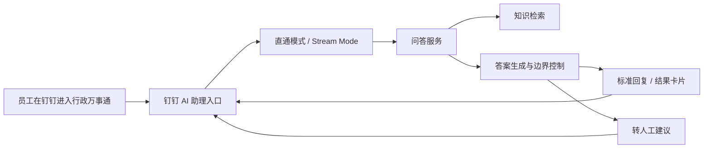

# 🏢 钉钉行政万事通一期搭建方案

> 面向公司内部员工，在钉钉内建设一个可直接使用的“行政万事通”AI 助理。  
> 一期目标不是做“大而全”的知识中台，而是先把可访问入口、高频问答、转人工边界和灰度机制跑通。

---

## 📑 目录

- [📌 文档概览](#-文档概览)
- [🎯 一期目标](#-一期目标)
- [🖼️ 目标形态](#️-目标形态)
- [📦 一期范围](#-一期范围)
- [⚖️ 方案选型](#️-方案选型)
- [🏗️ 总体架构](#️-总体架构)
- [🧭 钉钉侧设计](#-钉钉侧设计)
- [🤖 问答服务设计](#-问答服务设计)
- [🗂️ 知识库设计](#️-知识库设计)
- [🚨 转人工与风险边界](#-转人工与风险边界)
- [🚀 灰度上线方案](#-灰度上线方案)
- [🗓️ 实施节奏](#️-实施节奏)
- [🔭 后续扩展方向](#-后续扩展方向)
- [✅ 结论](#-结论)

---

## 📌 文档概览

| 项目 | 内容 |
| --- | --- |
| 文档主题 | 钉钉行政万事通一期搭建方案 |
| 面向对象 | 产品、研发、项目负责人、行政业务负责人 |
| 建设阶段 | 一期 MVP |
| 核心目标 | 先上线一个钉钉内可用的行政问答助理 |
| 推荐形态 | 钉钉组织内 AI 助理 + 自建问答服务 |
| 优先部门 | 人力行政部 |

### 📝 文档定位

这份文档用于回答 3 个核心问题：

1. 一期到底要先做成什么样  
2. 在钉钉里应该怎么搭  
3. 什么范围先做，什么先不做  

---

## 🎯 一期目标

一期只聚焦最小可用闭环，目标控制在以下 4 件事：

- 在钉钉内提供一个员工可访问的行政问答入口
- 支持员工用自然语言提问行政高频问题
- 基于结构化知识返回统一口径的答案
- 在答案不确定时明确转人工，而不是继续猜测

### ✅ 一期成功标准

满足以下条件，即可认为一期达到可上线标准：

| 维度 | 标准 |
| --- | --- |
| 入口 | 员工能在钉钉中找到并进入行政万事通 |
| 体验 | 首页具备欢迎语、快捷问题、输入框、会话区 |
| 回答 | 能稳定回答行政高频 FAQ |
| 边界 | 不确定时能明确转人工 |
| 运营 | 能持续补充问题、修正答案、更新负责人 |

### ❌ 一期不追求

- 全公司所有部门同时上线
- 一次性导入全部制度文档
- 自动审批、自动办理、复杂系统联动
- 完整知识治理平台或统一运营后台

---

## 🖼️ 目标形态

结合当前目标截图，一期目标不是一个“只能回复文本的机器人”，而是一个在钉钉里看起来像正式产品入口的行政助理。

### ✨ 目标界面至少包含

- 助理名称、头像、欢迎语
- 一段清晰的能力说明
- 4 到 8 个快捷问题卡片
- 底部输入框
- 会话区，支持返回文本或结果卡片

### 🧩 对应到产品交付

| 交付层 | 一期要求 |
| --- | --- |
| 入口层 | 钉钉内可进入的组织内 AI 助理 |
| 展示层 | 欢迎区、快捷提问、会话区 |
| 能力层 | 行政问题理解、知识检索、答案生成、转人工 |
| 内容层 | 行政 FAQ、制度依据、负责人、更新时间 |

### 💡 体验原则

- 一眼看懂这是“行政办事入口”
- 员工打开后不需要学习就能开始提问
- 首页就能引导员工提常见问题
- 回答不要像模型闲聊，要像正式企业助手

---

## 📦 一期范围

一期只覆盖人力行政部高频问答，优先收录以下主题：

- 入职、转正、调岗、离职流程
- 请假、考勤、加班、补卡规则
- 出差、报销、福利、社保、公积金说明
- 工牌、门禁、工位、办公用品、固定资产申请
- 用章、访客、会议室、车辆等行政流程
- 员工证明、档案、合同相关常见问题
- OA 或人事系统常见操作说明
- 审批路径和联系人信息

### 🎯 一期优先问题类型

| 类型 | 示例 |
| --- | --- |
| 高频咨询 | 请假怎么申请、补卡怎么补 |
| 易错规则 | 社保什么时候开始缴纳、报销标准是什么 |
| 办理流程 | 会议室怎么预订、访客怎么申请 |
| 系统操作 | OA 里去哪里发起申请 |
| 升级边界 | 电脑坏了找谁、特殊情况找谁处理 |

---

## ⚖️ 方案选型

### 方案对比

| 方案 | 形态 | 优点 | 风险/不足 | 是否推荐 |
| --- | --- | --- | --- | --- |
| 传统群机器人 | 群聊问答 | 接入快 | 首页体验弱，产品感不足，不适合承载正式“万事通” | 否 |
| 钉钉 AI 助理 + 自建问答服务 | 原生助理入口 + 自有能力 | 体验更完整，口径可控，便于后续扩展 | 需要做接入与联调 | 是 |
| 纯自建 H5 办事页 | 自定义最强 | 可完全自定义页面 | 钉钉内使用路径更长，前期建设成本更高 | 备选 |

### ✅ 推荐方案

推荐采用：

**钉钉组织内 AI 助理 + 直通模式或 Stream Mode + 自建问答服务**

### 推荐原因

- 员工天然在钉钉里办公，入口阻力最低
- 一期重点是问答，不是复杂办理，自建服务更容易控制口径
- 能先做出接近截图中的助理产品形态
- 后续扩到销售、客服、法务等部门时，底层可以复用

---

## 🏗️ 总体架构

### 🔄 总体流程



### 🧱 核心模块

| 模块 | 说明 |
| --- | --- |
| 钉钉入口层 | 组织内 AI 助理，承载首页、会话、消息交互 |
| 接入层 | 直通模式或 Stream Mode，用于接收用户消息并返回回复 |
| 问答服务 | 负责识别问题、检索知识、拼装答案 |
| 知识层 | 结构化 FAQ 为主，制度原文作为依据 |
| 运营层 | 用于维护问题、答案、负责人、更新时间 |

---

## 🧭 钉钉侧设计

### 1. 入口形态

一期建议将“行政万事通”发布为**组织内 AI 助理**，让员工通过钉钉搜索、IM 会话或企业内部入口直接进入。

### 2. 必要前置条件

- 企业管理员授权应用开发权限
- 创建组织内应用或 AI 助理
- 配置可用的消息接入方式
- 明确一期可访问人群，先采用灰度开放

### 3. 接入模式建议

| 模式 | 适用情况 | 建议 |
| --- | --- | --- |
| 直通模式 | 希望钉钉只做入口，回答完全由自建服务控制 | 优先推荐 |
| Stream Mode | 后续还要统一接更多消息或事件 | 可选 |

### 4. 页面形态边界

结合当前公开文档和产品能力判断，一期应按以下思路设计：

> **钉钉原生 AI 助理外壳 + 我们自定义助理内容**

### 5. 可重点配置内容

- 助理名称、头像、简介
- 欢迎语或开场说明
- 快捷问题或建议提问
- 对话中的标准文本回复
- 对话中的结果卡片

### 6. 当前边界判断

| 项目 | 结论 |
| --- | --- |
| 能否做成正式助理入口 | 可以 |
| 能否有欢迎语与建议问题 | 可以重点设计 |
| 能否在对话中发卡片 | 可以 |
| 能否完全复刻截图所有外层布局 | 当前不建议直接假定可以 |

> 说明：目前可确认钉钉 AI 助理可在 IM/魔法棒中使用，也支持结果卡片；但尚不应在一期方案中默认“截图里的整层壳完全可开发者自定义”。  
> 因此，一期先按“原生壳 + 自定义内容”落地更稳。

---

## 🤖 问答服务设计

### 1. 回答流程

服务端收到用户问题后，按以下顺序处理：

1. 判断是否属于行政范围  
2. 识别问题主题，如考勤、报销、办公支持、社保等  
3. 在结构化知识库中召回最相关条目  
4. 结合条目内容生成最终回答  
5. 补充依据、适用范围和例外说明  
6. 若置信度不足，直接转人工  

### 2. 回答规则

| 规则 | 要求 |
| --- | --- |
| 统一口径 | 优先使用标准答案，不自由发挥 |
| 面向办理 | 能给步骤就给步骤，不只讲原则 |
| 明确范围 | 说明适用于哪些人、哪些场景 |
| 主动提示例外 | 有特殊情况时必须明确说明 |
| 边界清晰 | 不确定时直接转人工 |

### 3. 一期回答模板

建议统一输出以下结构：

- 结论
- 适用范围
- 办理步骤
- 例外情况
- 联系人或转人工方式
- 依据文件或系统入口

### 4. 回复对象示例

```ts
type AssistantReply = {
  summary: string;
  scope?: string;
  steps?: string[];
  exceptions?: string[];
  handoff?: {
    required: boolean;
    contact?: string;
    reason?: string;
  };
  references?: Array<{
    title: string;
    type: "policy" | "sop" | "system" | "contact";
  }>;
};
```

---

## 🗂️ 知识库设计

### 1. 一期优先数据形态

一期以**结构化 FAQ** 为主，不建议先以长文档直接入库。

### 2. 每条知识建议字段

| 字段 | 说明 |
| --- | --- |
| 所属部门 | 如人力行政部 |
| 问题分类 | 如考勤、报销、访客、设备支持 |
| 标准问题 | 员工最常见的提问方式 |
| 相似问法 | 口语化或近义问法 |
| 标准答案 | 用于直接回复员工 |
| 适用范围 | 适用于哪些人、哪些场景 |
| 处理步骤 | 办理流程或操作步骤 |
| 例外情况 | 特殊场景说明 |
| 转人工条件 | 何时必须人工介入 |
| 依据文件 | 制度、SOP、系统规则 |
| 附件或链接 | 文档、表单、系统入口 |
| 内容负责人 | 谁负责确认口径 |
| 更新时间 | 判断是否过期 |

### 3. 推荐知识规模

一期先整理 **50 到 100 条行政高频问题**。

### 4. 优先级排序原则

- 每周都会被问到的问题
- 最容易答错的问题
- 新员工最常问的问题
- 需要跨部门协同的问题

### 5. 数据样例

```json
{
  "department": "人力行政部",
  "category": "考勤",
  "question": "补卡流程是什么",
  "aliases": ["忘记打卡怎么补", "漏打卡怎么办"],
  "answer": "员工可在 OA 发起补卡申请，由直属主管审批。",
  "scope": "适用于因漏打卡导致考勤异常的员工",
  "steps": [
    "进入 OA 或钉钉审批入口",
    "选择补卡申请",
    "填写补卡日期、时段与原因",
    "提交直属主管审批"
  ],
  "exceptions": [
    "如涉及连续多日异常，请同步联系行政或 HR"
  ],
  "handoffCondition": "系统无法提交或记录异常时需人工处理",
  "owner": "行政专员A",
  "updatedAt": "2026-03-26"
}
```

---

## 🚨 转人工与风险边界

### 1. 必须转人工的场景

| 场景 | 原因 |
| --- | --- |
| 个案判断的人事政策 | 无法仅靠标准规则判断 |
| 员工隐私、薪酬、合同细节 | 涉及敏感信息 |
| 制度版本冲突或口径不明 | 风险高，不能自动回答 |
| 涉及法务、财务、审批边界的问题 | 非行政助手单独可裁定 |
| 系统、账号、设备异常 | 需要人工排查 |

### 2. 一期边界原则

> 宁可明确转人工，也不要给出看似完整但不可靠的答案。

### 3. 风险控制重点

- 不把推测当结论
- 不把个案当通用规则
- 不在敏感问题上“尽量回答”
- 不输出缺少依据的制度口径

---

## 🚀 灰度上线方案

### 1. 灰度范围

- 人力行政部内部成员
- 少量业务试点用户
- 项目组成员

### 2. 灰度观察指标

| 指标 | 说明 |
| --- | --- |
| 问题命中率 | 用户问题能否命中已建知识 |
| 首答可用率 | 第一轮回答是否已经可用 |
| 转人工占比 | 边界控制是否合理 |
| 错答率 | 是否存在明显错误回答 |
| 用户满意度 | 员工是否愿意继续使用 |
| 未覆盖问题数 | 需要补充的新问题规模 |

### 3. 灰度后迭代重点

- 补充未命中的高频问题
- 调整问题分类和相似问法
- 强化转人工规则
- 修正过于笼统或不够稳定的答案

---

## 🗓️ 实施节奏

### 阶段划分

| 阶段 | 目标 | 关键动作 |
| --- | --- | --- |
| 准备期 | 把入口和范围定清楚 | 明确管理员、业务负责人、接入方式 |
| 建设期 | 把助理和问答能力搭起来 | 整理 FAQ、接通服务、完成联调 |
| 灰度期 | 验证可用性与风险边界 | 小范围试用、补问题、修答案 |

### 1. 准备期

- 确定一期知识范围
- 确定钉钉管理员和业务负责人
- 创建组织内 AI 助理
- 确定消息接入方式

### 2. 建设期

- 整理行政问答条目
- 配置欢迎语与快捷问题
- 搭建问答服务
- 完成钉钉侧联调
- 输出统一回答模板

### 3. 灰度期

- 面向小范围用户试运行
- 收集未命中问题和错答案例
- 修正知识与回答逻辑
- 形成一期上线清单

---

## 🔭 后续扩展方向

当行政版万事通稳定后，再逐步扩展：

- 增加销售运营、客服、法务、供应链等部门知识
- 接入审批、表单、系统入口等动作能力
- 建立统一知识维护后台
- 增加答案引用、版本管理与运营报表

### 📈 演进路径建议

| 阶段 | 重点 |
| --- | --- |
| 一期 | 行政 FAQ 问答跑通 |
| 二期 | 多部门知识接入 |
| 三期 | 办事入口和系统动作联动 |
| 四期 | 知识治理、统计分析、持续运营 |

---

## ✅ 结论

一期最重要的，不是先做一个覆盖所有部门的“大平台”，而是先把下面这个最小闭环跑通：

- 一个钉钉内可访问的 AI 助理入口
- 一套员工打开就能理解的欢迎区与快捷问题
- 一组可直接回答行政高频问题的结构化知识
- 一条可控的问答链路
- 一套明确的转人工边界和灰度机制

只要这个闭环成立，后续无论是扩更多部门，还是继续向“查 + 办”一体化演进，都会顺得多。

---

## 🔗 参考说明

以下判断基于当前已核对的钉钉官方能力信息：

- AI 助理可在 IM / 魔法棒中使用
- AI 助理支持结果卡片
- 适合采用组织内 AI 助理承载一期入口

同时，本方案中“截图整层页面是否可完全自定义”的部分属于谨慎判断：

> 当前不建议在一期默认假设“截图中的所有外层布局都能完全自定义”。  
> 因此，更稳妥的方案是先按“钉钉原生壳 + 自定义欢迎内容、快捷问题、结果卡片”推进。
