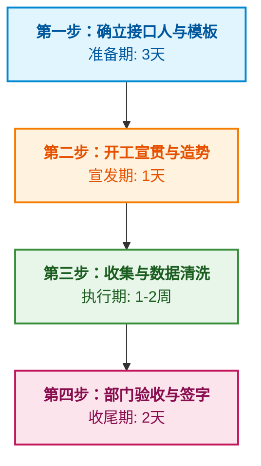

这份指南非常适合制作成一篇内部宣发文章或项目说明书。为了满足您“图文并茂”且“格式清晰”的需求，我为您使用了 **Markdown 高级排版**，加入了**视觉引导图标 (Emoji)**、**配图引用 (基于公共图库)** 以及直观的 **流程图表 (Mermaid)**。

您可以直接将以下代码复制到支持 Markdown 的编辑器（如钉钉文档、语雀、飞书文档、Typora、Notion 等）中查看完美效果：

---

# 🚀 企业钉钉“AI 万事通”：知识库收集与构建全流程指南

> **项目背景：** 为企业在钉钉上打造一个“万事通”（企业内部 AI 问答机器人）是一个非常有价值的数字化转型项目。万事通的“智商”完全取决于喂给它的**“知识库”**的质量。以下是第一阶段核心任务：**知识库收集与构建行动计划**。

---

## 🌟 核心理念：什么是真正的“知识库”？

在构建 AI 万事通的语境下，**知识库绝不是杂乱无章的文档堆砌**，而是经过结构化整理的、准确的、可被机器阅读的企业经验与规则。

### 📦 最佳数据形态

- **Q&A（问答对）**：形式清晰的 Excel / 钉钉在线表格。
- **结构化文档**：条理清晰、标题层级分明的 Word / PDF / Markdown 文档（如 SOP、规章制度、操作手册）。

### 🎯 黄金三标准

1.  ✅ **准确性**：内容必须是最新的、官方最终认可的版本。
2.  ✅ **全面性**：遵循“二八定律”，覆盖员工日常 80% 的最高频疑问（通常集中在 20% 的知识点上）。
3.  ✅ **无歧义**：描述清晰，少用容易产生歧义的代词。纯图片或扫描件需转为纯文本（OCR 转录）。

---

## 📊 各部门知识库：内容规划与收集策略

针对公司核心业务链路的六大部门，以下是知识提取的“靶向清单”与“落地收割法”：

### 👩‍💼 1. 人力行政部 (HR & Admin)

**【应该有什么库（高频痛点）】**

- **入职/离职指南：** 新员工入职流程、电脑申领、离职交接清单。
- **考勤与休假：** 上下班打卡规定、各类假期（年假/病假/产假）的请假规则及计算方式。
- **薪酬福利：** 社保公积金缴纳比例、报销标准与流程（差旅、招待费）、节日福利。
- **行政服务：** Wi-Fi 密码、打印机怎么连、名片印制流程、会议室预订规则。

**【该如何收集】**

- **现有文档提取：** 直接导入《员工手册》、《公司规章制度汇编》。
- **聊天记录挖掘：** 让 HR 专员和前台翻看微信/钉钉群，列出 **“每天被问到最烦的 Top 20 个问题”**，直接做成 Q&A。

### 📈 2. 销售运营部 (Sales Ops)

**【应该有什么库】**

- **产品与报价：** 最新产品报价单、折扣申请审批权限矩阵。
- **流程与系统：** CRM 系统（如销售易、纷享销客等）操作指南、建客与报备规则。
- **业务赋能：** 销售话术库（大客户破冰、常见抗性解答）、竞品分析对比卡。
- **合同流转：** 销售合同发起流程、盖章申请规范。

**【该如何收集】**

- **系统导出：** 导出 CRM 中的操作手册和帮助文档。
- **销冠访谈：** 收集销冠的优秀录音或总结，提取为“话术 Q&A”。
- **审批流逆向推导：** 总结过去一个月被驳回最多的审批单，提炼成“避坑指南”。

### 🎧 3. 客服部 (Customer Service)

**【应该有什么库】**

- **对外解答库（对内同效）：** 客户常见问题解答（FAQ）、产品故障排查树（SOP）。
- **内部协作：** 向研发/技术部门提交 Bug 的规范格式、客诉定级标准及升级处理流程（Escalation Process）。
- **退换货与理赔：** 退换货政策、退款链路及周期。

**【该如何收集】**

- **现有知识库平移：** 导出已有客服系统（如网易七鱼、晓多等）的快捷回复话术库，直接清洗。
- **工单复盘：** 抽取高频客诉工单，提炼标准解决方案。

### 🚀 4. 平台增长部门 (Platform Growth)

**【应该有什么库】**

- **指标字典：** 统一数据口径（如 DAU、ROI、转化率的具体计算公式，避免各部门“打架”）。
- **活动规范：** 营销活动提报 SOP、资源位申请流程、UTM 追踪链接生成规范。
- **渠道规则：** 各大投放渠道（抖音、小红书等）的过审规则、违禁词列表。

**【该如何收集】**

- 要求部门负责人直接提供日常使用的内部数据字典。
- 将内部 Wiki（语雀、飞书文档、Notion）中的工作流程文档打包导入。

### ⚖️ 5. 法务部 (Legal)

**【应该有什么库】**

- **模板库：** 常用合同标准模板（如 NDA 保密协议、采购框架协议）的获取路径或下载链接。
- **合规红线：** 广告法禁用词汇（绝对化用语等）、数据合规基础要求。
- **法务审核：** 合同法务审查的发起条件、非标合同的审批时长及所需材料。

**【该如何收集】**

- 由法务部出具《业务部门法律合规红线指南》。
- 收集业务线最常修改的合同条款，做成“法务 Q&A”（⚠️ **注：法务知识要求绝对准确，需法务总监最终确认签字**）。

### 📦 6. 供应链 (Supply Chain)

**【应该有什么库】**

- **采购流程：** 供应商入库标准及打分机制、采购申购单（PR）到采购订单（PO）的流转 SOP。
- **物流与仓储：** 发货周期承诺、异常件（丢件、破损）处理定责流程。
- **系统打通：** ERP 或 WMS 系统的基础操作 FAQ、库存盘点规则。

**【该如何收集】**

- 基于《供应链 AI 化改造痛点分析》文档，将痛点反向转换为“标准流程解答”。
- 收集与销售端对接的常见拉扯问题（如：为什么没货？什么时候发货？），制定标准回复话术。

---

## 🗺️ 知识库收集与执行四步走战略

为了避免收集工作变成“你催我拖”的烂尾工程，必须严格按照以下节奏推进（建议在线上建立统一的**多维表格**进行协作）：

### 📍 详细落地指南：

**第一步：确立接口人与模板（准备期 3 天）**

- **找对人：** 要求每个部门指派一名“知识库接口人”（通常是部门助理或业务骨干，**不要直接找部门负责人**，他们没空整理细节）。
- **给工具：** 严禁随便发零散文件。提供两种钉钉在线标准模板：
  - **模板 A（文档类）：** 要求排版整洁，删除大量无用配图，保留纯文本。
  - **模板 B（问答类）：** 三列极简版 Excel：`【标准问题】` + `【相似问法】` + `【标准答案】`。

**第二步：开工宣贯（宣发期 1 天）**

- **利益驱动：** 拉齐所有接口人开个简短宣贯会（或拉群发公告），核心要讲明：“万事通”做成后，**能为他们部门挡掉多少重复性的日常咨询**（如：一天少回 50 条钉钉消息）。并设定明确的提交 Deadline。

**第三步：收集与清洗数据（执行期 1-2 周）**

- **定期催收：** 关注进度，催促接口人按时在在线文档中更新。
- **主控清洗（至关重要）：** 作为 AI 项目负责人，您需要把关数据质量：
  1.  去除无效信息（如文档里的寒暄、过时的冗余规定）。
  2.  解决冲突（如：员工手册报销额度跟财务部给的不一致，需拉通拉齐）。
  3.  OCR 转换（将含有关键流程图的图片转成机器能读懂的文字）。

**第四步：部门验收与签字（收尾期 2 天）**

- **合规防线：** 收集完毕后，将整理好的知识库清单单独发回给各部门负责人审核。
- **确认红线：** 确保内容 **不违规、不泄密、完全准确**。

> 🎉 **写在最后：**
> 完成这四步后，您手中就掌握了极其优质的企业专属数据资产。接下来的工作，就是将这些结构化的数据一键导入到钉钉的 AI 机器人（如钉钉智能化应用、阿里通义千问企业版等）中，进行模型训练和内部灰度测试了。**期待贵司的“万事通”早日上线！**
