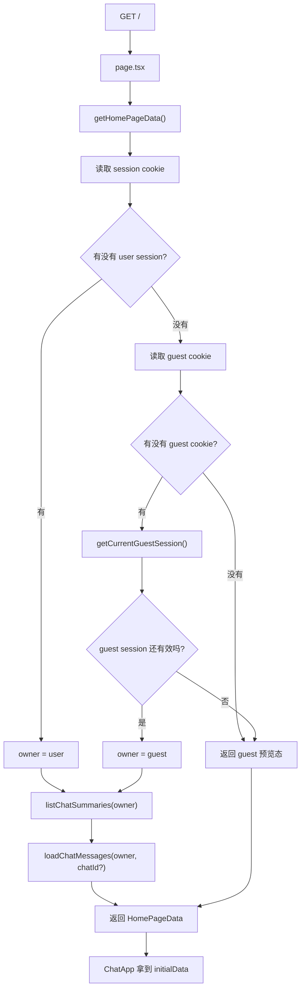
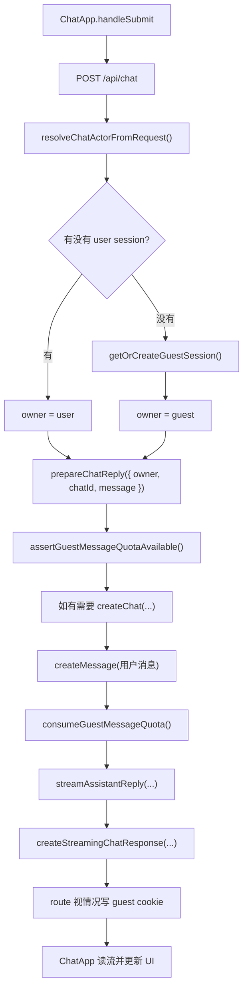
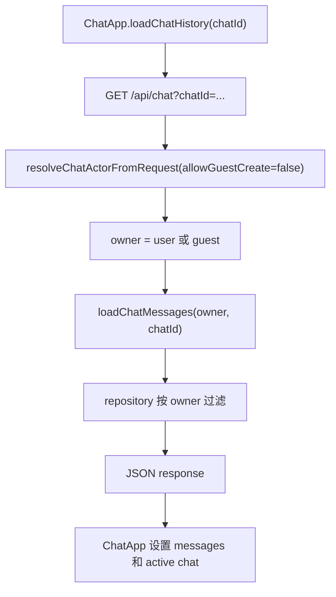

# Guest Session 和 Trial 学习文档

## 这一个阶段到底解决了什么

这一阶段的目标，是给“未登录用户”一个真实存在的服务端身份。

以前的逻辑是：

- 没有登录 session = 只是“未登录页面”
- 服务端并不认为这个人是一个可以拥有聊天数据的主体

现在的逻辑变成了：

- 没有用户 session = 也可以是一个 guest
- guest 真正开始聊天时会拿到一个 `httpOnly cookie`
- 服务端只会在能写 cookie 的 route 里给这个 guest 建一条 `GuestSession`
- guest 也能拥有自己的 chat
- 但 guest 的发消息次数会被服务端限制

所以现在服务端里，真正合法的聊天拥有者有两种：

- 已登录用户
- guest session

这就是这次代码最核心的变化。

---

## 明天建议你先看哪些文件

按这个顺序看，最容易懂：

1. `prisma/schema.prisma`
2. `src/server/guest/guest-session.ts`
3. `src/server/guest/guest-service.ts`
4. `src/server/chat/chat-types.ts`
5. `src/server/chat/chat-service.ts`
6. `src/server/page/home-data.ts`
7. `src/app/api/chat/route.ts`
8. `src/components/chat-app.tsx`

为什么按这个顺序：

- 先看数据长什么样
- 再看 guest cookie 和 guest session 怎么恢复
- 再看 chat owner 怎么抽象
- 再看 route 怎么把请求转成 owner
- 最后看前端怎么消费这些状态

你如果一上来先看 `chat-app.tsx`，会很容易晕，因为它是结果层，不是起点层。

---

## 你先记住两个最重要的数据结构

## 1. `ChatOwner`

文件：`src/server/chat/chat-types.ts`

这次最关键的重构就是它：

```ts
type ChatOwner =
  | { kind: "user"; userId: string }
  | { kind: "guest"; guestSessionId: string };
```

它的意义是：

- repository 不再只认 `userId`
- service 不再写死“这个聊天一定属于用户”
- route 的工作，变成先判断“这次请求到底是谁”

你明天读代码的时候，一直问自己一句话：

> 这里有没有已经把请求身份转换成 `ChatOwner`？

如果已经转成了，后面的代码就会顺很多。

因为后面的 service / repository，就只关心：

- 这是 `user owner`
- 还是 `guest owner`

而不需要反复重新读 cookie。

## 2. `HomePageData`

文件：`src/server/page/home-data.ts`

首页服务端启动时，现在会把这些数据一次性塞给前端：

- `viewerKind`
- `isAuthenticated`
- `currentUser`
- `guestSession`
- `initialChats`
- `initialMessages`
- `initialChatId`

你可以把它理解成：

> 服务端给前端的“首屏身份包 + 首屏聊天包”

以前首页只知道“你是不是登录了”。

现在首页还知道：

- 你是不是 guest
- 当前是不是已经有可恢复的 guest session
- 如果已经有，这个 guest 还剩几次试用
- 如果已经有，这个 guest 对应的聊天列表和消息

这就是服务端状态和前端 UI 之间的桥。

---

## 调用流程 1：第一次匿名访问首页



这里有一个非常重要的点：

- `home-data.ts` 可以“读 cookie”
- 但是它不能“写 cookie”

所以如果这是一个第一次来的匿名访客，首页现在只会返回 guest 预览态，不会提前创建 `GuestSession`。

这样做的目的很直接：

- 路过首页但没有真正开始聊天的人，不会往数据库里留下悬空 guest session
- 真正的 guest 建立，要等后面的 route response 去做

这也是为什么后面 `/api/chat` 和 `/api/auth/session` 都需要负责补写 guest cookie。

---

## 调用流程 2：guest 发送消息



这个流程里，你一定要重点看两个顺序：

### 顺序 1：先检查额度，再做昂贵工作

也就是先：

- `assertGuestMessageQuotaAvailable()`

再去：

- 生成标题
- 创建 chat
- 调模型

因为如果 guest 已经没额度了，就不应该再浪费后面的工作。

### 顺序 2：用户消息真正写进库后，才消耗次数

也就是：

1. 先 `createMessage(user message)`
2. 再 `consumeGuestMessageQuota()`

为什么这个顺序重要：

如果你先扣额度，后面数据库写消息失败了，那么 guest 会白白损失一次机会。

这是我昨晚额外补掉的一个真实边界问题，你明天可以重点看这个测试。

---

## 调用流程 3：guest 读取历史消息



这里真正的安全边界不在前端，而在 repository。

因为 repository 会按 owner 做过滤：

- `user` 用 `userId`
- `guest` 用 `guestSessionId`

所以即使有人传了一个不属于自己的 `chatId`，最终查不出来数据。

也就是说：

- route 负责把请求转成 owner
- repository 负责按 owner 收口

---

## 你明天怎么读“函数调用链”

你之前说，最想学的是：

> 这些函数和方法到底是怎么一层层调用下去的

那你明天就用这个固定方法读，不要乱跳。

## 第一步：先找触发点

先问自己：

- 这是页面渲染触发的？
- 这是浏览器点击触发的？
- 这是一个 HTTP 请求触发的？

例子：

- 页面渲染：`getHomePageData`
- 用户发送消息：`handleSubmit`
- 接口入口：`POST /api/chat`

如果你连触发点都没找准，后面很容易看乱。

## 第二步：找“边界转换”

所谓边界转换，就是：

> 原始请求信息，在哪一行开始变成业务层能理解的数据

这次最重要的几个边界转换是：

- `cookie header -> session token`
- `guest cookie -> guest session 或 guest preview`
- `session / guest session -> ChatOwner`
- `服务端首屏数据 -> HomePageData`

你每次只要找到这一步，后面会清楚很多。

## 第三步：一层一层往下跟

你可以固定记住这个规则：

- route：处理 HTTP
- service：处理业务规则
- repository：处理数据库查询

不要把三层混在一起看。

正确看法是：

1. route 收到什么
2. route 交给 service 什么
3. service 做了哪些业务判断
4. service 最后让 repository 查什么

## 第四步：问“往下传的参数长什么样”

这是最实用的一步。

比如你看到一个函数调用时，就盯住参数：

- route 往下传的是不是 `owner`
- service 往下传的是不是 `chatId`、`message`
- repository 最后组出来的 `where` 是什么

顺着参数看，比顺着文字解释看更快。

---

## 每一层各自到底负责什么

## `guest-session.ts`

它只负责 cookie / token 这种机械工作：

- guest cookie 名字是什么
- guest cookie 选项是什么
- 过期时间怎么算
- 怎么从 cookie header 里读出 token

所以这个文件应该尽量“笨”。

它不要掺业务规则。

你可以把它当成：

> guest cookie 工具箱

## `guest-service.ts`

它负责 guest 生命周期和 guest 额度规则：

- 当前 guest 还在不在
- 没有 guest 时要不要新建
- 这个 guest 还能不能继续发
- 真正成功后怎么扣次数

你可以把它拆成两类函数来看：

- `getCurrentGuestSession`
  只负责“如果你已经有 guest token，我帮你确认它还活着没有”
- `getOrCreateGuestSession`
  只在能写 cookie 的 route 里用，负责“没有就创建，有就恢复”

你读这个文件时，脑子里只保留一句话：

> 这个 guest 现在到底还能不能继续聊天？

## `chat-service.ts`

它负责聊天业务本身，但不关心你是 user 还是 guest。

它关心的是：

- 列表怎么读
- 消息怎么读
- 标题怎么改
- 删除怎么做
- 发消息怎么准备回复

它回答的问题是：

> 已经知道 owner 以后，聊天业务该怎么走？

## `route.ts`

它只处理 HTTP 层的事情：

- 解析 request
- 从 cookie 恢复 actor
- 把错误映射成 HTTP status
- 必要时写回 guest cookie

它回答的问题是：

> 一个 HTTP 请求，怎么变成一次业务调用？

## `chat-app.tsx`

它只处理前端交互状态：

- 当前是 user 还是 guest
- 什么时候要展示重新登录
- 什么时候还能发消息
- 什么时候变成只读
- 什么时候展示 CTA

它回答的问题是：

> 以当前这个 viewer 的身份，页面应该长什么样？

---

## 这次前端最重要的 3 个状态

你明天读 `ChatApp` 的时候，所有分支都尽量归类到这 3 个状态里。

## 1. 已登录用户

特点：

- `isAuthenticated === true`
- 完整账号体验

## 2. 可用中的 guest

特点：

- `viewerKind === "guest"`
- 可能还只是 guest 预览态
- 也可能已经有 `guestSession`
- 真正第一次成功发消息后，route 会补写 cookie，guest 身份才会稳定落到浏览器

## 3. auth 锁定 / recovery 状态

特点：

- 没有 authenticated user
- 也没有当前可用的 guest 会话状态
- 常见于 `401` 之后

你只要一旦看乱，就立刻停下来问自己：

> 这一段代码到底是在处理这 3 种里的哪一种？

这个方法很有用。

---

## 401 / 403 在这条链路里怎么理解

这次你顺便也可以一起复习。

## 401

在这条 guest / auth 链路里，401 更像是：

- 你本来应该有身份
- 但服务端现在无法承认你这个身份了

典型场景：

- session 过期了
- guest session 失效了
- guest session 已 merged

所以前端遇到 401，常常会走：

- 切回 recovery / 登录态

## 403

403 代表：

- 你是谁，服务端是知道的
- 但这个动作不允许你继续做

这次最典型的 403 就是：

- guest 试用次数已经用完

所以前端不应该把它当成“登录失效”，而应该当成：

- 还保留历史
- 但发送被锁住
- 提示登录 / 注册升级

---

## 如果以后这里出 bug，你先问这 5 个问题

1. 这次请求最后解析出来的 `ChatOwner` 对不对？
2. guest cookie 是根本没有、过期了，还是没被写回浏览器？
3. route 这次调用的是 `getCurrentGuestSession`，还是 `getOrCreateGuestSession`？
4. 额度失败，是失败在“可用性检查”还是失败在“真正扣减”？
5. 前端现在展示的是“guest 额度用完”，还是错误地展示成“登录失效”？

补一句现在很重要的排查背景：

- 首页 `getHomePageData` 在“没有 guest cookie”时不会再创建 `GuestSession`
- 所以“首页看起来是 guest”不等于数据库里已经有 guest session

这 5 个问题很适合排查这块。

---

## 你明天最适合怎么学

我建议你明天按下面顺序学，不要一口气全翻：

1. 先打开 `src/app/api/chat/route.ts`，只追 `POST`
2. 再打开 `src/server/chat/chat-service.ts`，只追 `prepareChatReply`
3. 然后打开 `src/server/guest/guest-service.ts`，重点比较：
   - `assertGuestMessageQuotaAvailable`
   - `consumeGuestMessageQuota`
4. 再回到 `src/components/chat-app.tsx`，只追 `handleSubmit`
5. 最后把测试和生产代码一行一行对起来看

你可以把测试理解成“地图”，把实现理解成“真实地形”。

测试会告诉你：

- 预期行为是什么
- 哪些边界是重要的
- 哪些状态切换是故意设计的

---

## 明天你如果要问我，最适合这样问

你可以直接这样问我，我会更容易带你读：

- “我们先只看 `/api/chat` 的 POST，从 request 一路跟到 repository”
- “你给我解释一下 `resolveChatActorFromRequest` 为什么要这么写”
- “为什么 guest 要拆成可用性检查和真正扣减两步”
- “`HomePageData` 现在为什么要多一个 `viewerKind`”
- “这段 `ChatApp` 分支到底是在处理 guest 还是 recovery”

这样我们可以一段一段拆，不会乱。

如果你愿意，明天我可以直接按这份中文文档，带你做一次“只读代码不改代码”的逐层讲解。
