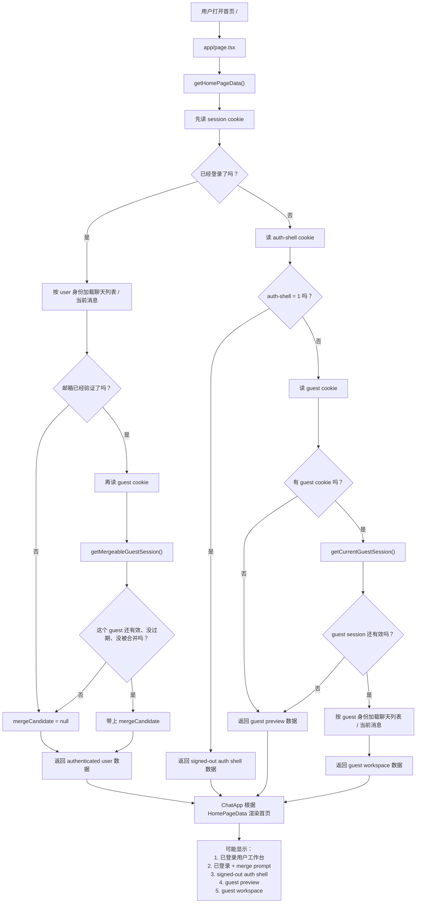
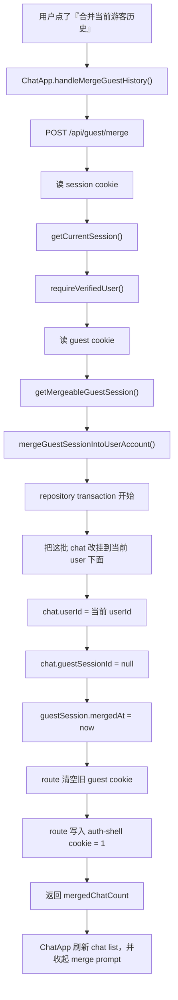
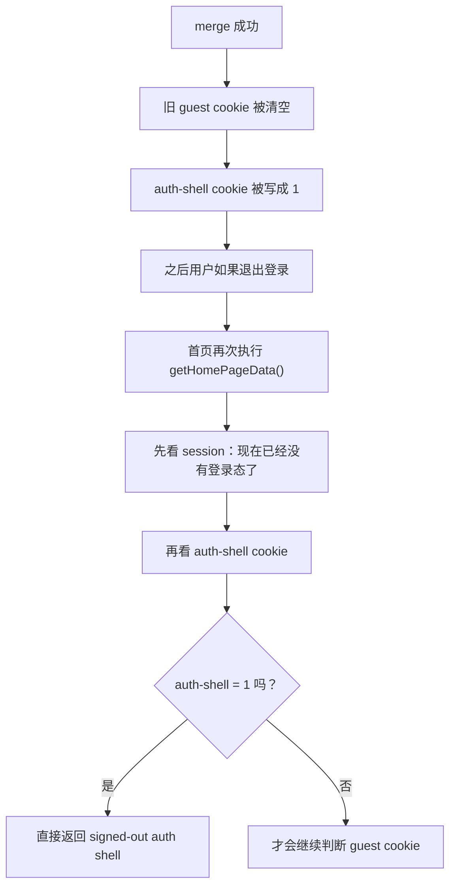

# Guest History Merge 学习文档

## 这一个阶段到底解决了什么

这一阶段的目标，是把“游客阶段产生的聊天历史”正式转移给已登录用户。

上一阶段我们解决的是：

- guest 可以拥有服务端身份
- guest 可以拥有自己的 chat
- guest 会被服务端限制试用次数

但那时还有一个没补完的问题：

- 用户后来注册 / 登录以后
- 之前这个浏览器里的 guest chat 还挂在 `GuestSession` 上
- 还没有真正变成“这个用户自己的历史”

所以这一阶段补的是：

- 已验证邮箱的用户，可以看到“当前浏览器里有游客历史可合并”
- 用户点一次合并后，chat ownership 会从 `guestSessionId` 转到 `userId`
- 原来的 `GuestSession` 会被标记 `mergedAt`
- merge 成功时还会清掉旧的 guest cookie，并写一个“优先回登录 / 注册入口”的 auth-shell cookie
- 之后这条 guest session 就不再被当成可继续使用的 guest 身份，退出登录后也不会自动再发一条新的 guest 配额

所以这一阶段最核心的变化不是“又加了一个提示框”，而是：

> 系统第一次支持把聊天所有权从 `guest` 正式迁移到 `user`

---

## 这件事和“邮箱验证”到底是什么关系

这两个概念很容易混：

- 邮箱验证，解决的是“这个账号能不能被当成完整用户主体使用”
- guest history merge，解决的是“这个浏览器里的游客聊天，要不要归到当前账号下面”

所以它们不是同一件事，而是前后依赖关系：

1. 先登录
2. 再完成邮箱验证
3. 只有 verified user，才允许 merge guest history

为什么要这样：

- 如果账号还没验证，就先不让它吃下 guest 历史
- 不然一个未激活账号也能接管游客历史，边界会变松

你可以记一句最实用的话：

> 邮箱验证是在确认“你这个 user 靠不靠谱”，merge 是在决定“这段 guest 历史要不要正式归你”

---

## 明天建议你先看哪些文件

按这个顺序看，会最顺：

1. `prisma/schema.prisma`
2. `src/server/guest/guest-session.ts`
3. `src/server/guest/guest-types.ts`
4. `src/server/guest/guest-repository.ts`
5. `src/server/guest/guest-service.ts`
6. `src/app/api/guest/merge/route.ts`
7. `src/server/page/home-data.ts`
8. `src/app/api/auth/session/route.ts`
9. `src/components/chat-app.tsx`

为什么这样看：

- 先看 `mergedAt` 这个数据字段长什么样
- 再看 merge 后多出来的 cookie 工具是什么
- 再看 repository 里 ownership 是怎么改的
- 再看 service 怎么定义“什么 guest 才能 merge”
- 再看 route 怎么把 cookie 和 session 变成一次 merge 调用
- 最后看前端怎么把它展示成 prompt

---

## 你先记住两个最重要的数据结构

## 1. `GuestSession.mergedAt`

文件：`prisma/schema.prisma`

这次最关键的数据不是新 chat 表，也不是新 owner 类型，而是 guest session 上这个字段：

```ts
mergedAt DateTime?
```

它的意义是：

- `null` = 这条 guest session 还没被合并
- 有值 = 这条 guest session 已经完成 ownership transfer

它很重要，因为它不是“提示用字段”，而是真实业务边界。

后面很多逻辑都靠它收口：

- `getCurrentGuestSession` 会把 `mergedAt !== null` 的 session 视为不可用
- `getMergeableGuestSession` 本质上也只认“还活着、没过期、没 merged”的 guest
- merge 成功以后，不需要立刻删 cookie，后面的读取逻辑也会自然把它当成失效

你读代码时可以一直盯住一句话：

> 这里有没有检查 `mergedAt`？

如果有，那这段逻辑大概率就在处理“合并后还能不能继续把它当 guest 用”。

## 2. `mergeCandidate`

文件：`src/server/page/home-data.ts`

这次前端不是直接自己猜“要不要展示 merge 按钮”，而是服务端首屏就把 merge 候选人算好：

- `mergeCandidate`

它现在代表的是：

- 当前请求已经有 user session
- 当前 user 已通过邮箱验证
- 当前浏览器里还带着一个可用 guest cookie
- 对应 guest session 仍然 active，且还没 merged

也就是说它不是“有 cookie 就给你看”，而是：

> 服务端已经替前端算好：这个浏览器里，确实存在一段可以合法合并的游客历史

## 3. `ai-chat-auth-shell` cookie

文件：`src/server/guest/guest-session.ts`

这是这次后面补上的一个很关键的小机制。

它的意义不是“身份 cookie”，而是：

- 这个浏览器在 merge 完以后
- 如果用户再退出登录
- 首页应该优先回登录 / 注册入口
- 而不是立刻再自动创建一条新的 guest session

所以它更像一个产品状态开关：

- 没有它：未登录时仍然可以按 guest preview / guest session 继续走
- 有它：未登录时优先回 auth shell

你可以把它理解成：

> merge 成功以后，服务端多记住了一件事：“这个浏览器接下来先别再自动发新的 guest 配额了”

---

## 调用流程 1：已验证用户回到原来的 guest 浏览器



这里最重要的一点是：

- merge prompt 不是前端自己查数据库
- 也不是前端自己去猜 cookie 状态

而是服务端在 bootstrap 阶段就把这个问题提前判断掉。

所以你可以把 `mergeCandidate` 理解成：

> “这个浏览器里，服务端认可的可合并游客历史提示”

再换成更白话一点的话，首页现在其实会分成 5 种状态：

1. 已登录用户工作台
   这是最普通的账号态，直接按 user 身份加载聊天数据。
2. 已登录用户工作台 + merge prompt
   用户已经登录且邮箱已验证，同时浏览器里还有一段仍然有效的 guest 历史，所以前端会多显示一个“要不要合并”的提示。
3. signed-out auth shell
   用户当前没登录，但浏览器里有 `ai-chat-auth-shell=1`，所以首页优先回到登录 / 注册入口，不再继续走 guest 恢复逻辑。
4. guest preview
   用户没登录，也没有可恢复的 guest session，这时首页只给一个游客预览态，不提前创建新的 guest session。
5. guest workspace
   用户没登录，但浏览器里有有效的 guest cookie，对应的 guest session 还活着，所以首页会按 guest 身份把聊天历史恢复出来。

这里最容易绕的一点是：

- “已登录但邮箱还没验证”
- 和 “没登录但被 auth-shell cookie 引导回登录入口”

这两个不是同一种状态。

前者还是已登录用户，只是 `mergeCandidate = null`。

后者则是根本没登录，只是首页被明确要求优先显示登录 / 注册入口。

---

## 调用流程 2：用户点击“合并当前游客历史”



把它翻成一句人话就是：

> 前端发起一次 merge 请求，服务端先确认“你是不是已验证用户”，再确认“浏览器里这段 guest 历史还能不能接”，确认都没问题后，才真正去改数据库 ownership，最后顺手把浏览器后续入口也切到 auth shell 规则。

这里真正要盯住的顺序是：

### 顺序 1：先确认“你是谁”，再确认“你能不能 merge”

也就是先：

- `getCurrentSession`
- `requireVerifiedUser`

再去：

- `getMergeableGuestSession`

因为 merge 不是单纯的 guest 行为，而是“某个 verified user 要接管这段历史”。

### 顺序 2：先改 chat ownership，再标记 guest merged

repository 里 transaction 的核心顺序是：

1. 先把所有 `guestSessionId = xxx` 的 chat 改成 `userId = 当前用户`
2. 再把这条 `GuestSession` 标成 `mergedAt = now`

为什么这个顺序重要：

如果你先标 `mergedAt`，后面 chat ownership 更新失败，就会出现一种很糟糕的中间态：

- 这条 guest 已经不能继续用了
- 但 chat 还没真正转到 user 下面

现在用 transaction，就是为了避免这种半成功状态。

### 顺序 3：merge 成功后，马上把浏览器引导到 auth shell 规则

route 成功返回前，还会做两件事：

1. 清掉原 guest cookie
2. 写入 `ai-chat-auth-shell=1`

这一步不是 ownership transfer 本身，但它决定了后面的产品行为：

- 退出登录后不会立刻又拿到一条新的 guest trial
- 首页会先回登录 / 注册入口

所以现在 merge 已经不是“只有数据库变了”，而是：

> 数据库 ownership 和浏览器后续入口策略，一起切换了

---

## 调用流程 3：merge 之后，这个 guest 为什么看起来“失效了”



这一步很容易被误会成：

- “是不是只要数据库里 `mergedAt` 有值就够了？”

现在真实情况是两层都在收口：

1. 数据库层：
   - `GuestSession.mergedAt` 让旧 guest session 失效
2. 浏览器入口层：
   - 清旧 guest cookie
   - 写 auth-shell cookie
   - 让未登录首屏优先回认证入口

所以现在不只是“后面哪怕浏览器还带着 cookie 也会失效”，而是：

- 旧 guest session 本身不可用了
- 浏览器入口也被明确改成“先回登录 / 注册入口”

这就是现在这套组合的真正意义：

> `mergedAt` 负责终结旧 guest 身份，auth-shell cookie 负责控制 merge 后退出登录该回哪一种首屏

---

## ownership 真正是在哪一层被转移的

这个问题非常关键。

很多时候你看前端 prompt、route 名字，会误以为：

> “是不是 route 一调用，ownership 就已经换了？”

其实不是。

真正发生 ownership transfer 的地方，在 repository transaction：

- `chat.userId <- userId`
- `chat.guestSessionId <- null`

也就是说：

- route 负责处理 HTTP
- service 负责定义 merge 规则
- repository 才真正写数据库，把 chat 从 guest owner 改成 user owner

你明天读代码时，可以一直问自己一句话：

> 到底是哪一行，真的把 chat 从 guest 变成了 user？

只要找到那一行，你就抓住这次功能最核心的落点了。

---

## 每一层各自到底负责什么

## `guest-repository.ts`

它负责最底层的持久化动作：

- 找 guest session
- 更新 guest trial 计数
- 批量把 guest chats 改挂到 user 下面
- 给 guest session 写入 `mergedAt`

它回答的问题是：

> 数据库里到底要改哪几张表、哪几个字段？

## `guest-service.ts`

它负责 merge 规则，不直接碰 cookie：

- 这个 guest token 现在还能不能被 merge
- 这个 guest session 现在是不是 active
- merge 前要不要拦截过期 / 已 merged 的 session

它回答的问题是：

> 这条 guest session 现在有没有资格被转移给 user？

## `/api/guest/merge/route.ts`

它只处理 HTTP 和身份边界：

- 读 auth cookie
- 读 guest cookie
- 要求当前 user 必须 verified
- merge 成功后清理 guest cookie
- merge 成功后写 auth-shell cookie
- 把错误映射成 401 / 403 / 400

它回答的问题是：

> 这一条浏览器请求，能不能变成一次合法的 merge 调用？

## `home-data.ts` / `/api/auth/session`

它们不是做 merge 本身，而是做 merge candidate 探测：

- 当前用户是不是 verified
- 当前浏览器里有没有可 merge 的 guest
- 当前浏览器是不是应该优先回 auth shell
- 要不要把 `mergeCandidate` 传给前端

它们回答的问题是：

> 前端现在应不应该知道“你还有一段游客历史可以接回来”，以及未登录时该先回 guest 还是先回 auth shell

## `chat-app.tsx`

它只负责交互状态：

- 是否展示 merge prompt
- 点合并后调用哪个 route
- 成功后怎么收起 prompt
- 怎么刷新 chat list

它回答的问题是：

> 以当前这个 viewer 的身份，页面要不要提醒你接管游客历史

---

## 这次前端最重要的 3 个状态

你明天读 `ChatApp` 时，可以把 merge 相关分支都归到这 3 类里：

## 1. verified user + 有 mergeCandidate

特点：

- `isAuthenticated === true`
- `currentUser.isEmailVerified === true`
- `mergeCandidate !== null`

这是唯一会看到 merge prompt 的状态。

## 2. verified user + 没有 mergeCandidate

特点：

- 已登录
- 已验证
- 当前浏览器里没有可 merge 的 guest，或者已经 merge 完了

这时 UI 就是普通 authenticated workspace。

## 3. signed-out auth shell

特点：

- `isAuthenticated === false`
- `viewerKind === "user"`
- 常见于 merge 后又退出登录，或者其它明确要求先回认证入口的场景

这时前端不会优先给你一个新的 guest trial，而是先给你登录 / 注册入口。

## 4. authenticated but unverified

特点：

- 已登录
- 但 `isEmailVerified === false`

这时前端不会展示 merge prompt。

因为在业务定义里：

- 未验证账号还不能接手 guest 历史

---

## 401 / 403 在 merge 链路里怎么理解

这次也顺便一起复习：

## 401

在 merge 这条链路里，401 更像是：

- 你本来以为这里还有合法身份
- 但服务端现在已经不能承认了

典型场景：

- 用户 session 没了
- guest cookie 对应的 session 不存在
- guest session 已过期
- guest session 已 merged

## 403

403 代表：

- 服务端知道你是谁
- 但你现在还没有权限做 merge

这次最典型的 403 是：

- 当前 user 还没完成邮箱验证

所以你可以记成：

- `401` = 身份不存在 / guest 不可用了
- `403` = 身份存在，但还没资格 merge

---

## 如果以后这里出 bug，你先问这 5 个问题

1. 当前用户到底是不是 verified user？
2. 这次请求里的 guest cookie，对应的 session 还 active 吗？
3. 这条 `GuestSession` 的 `mergedAt` 现在是不是已经有值？
4. merge 成功后，route 有没有真的清掉 guest cookie 并写入 auth-shell cookie？
5. 前端现在没显示 merge prompt，到底是没有 `mergeCandidate`，还是其实已经被本地 dismiss 掉了？

这 5 个问题非常适合排查这一块。

---

## 你明天最适合怎么学

我建议你按这个顺序学，不要一口气全翻：

1. 先打开 `src/app/api/guest/merge/route.ts`，只追 `POST`
2. 再打开 `src/server/guest/guest-session.ts`，只看 merge 后新加的 cookie 工具
3. 再打开 `src/server/guest/guest-service.ts`，只追：
   - `getMergeableGuestSession`
   - `mergeGuestSessionIntoUserAccount`
4. 再打开 `src/server/guest/guest-repository.ts`，只追：
   - `mergeGuestSessionIntoUser`
5. 然后回到 `src/server/page/home-data.ts`，看 `mergeCandidate` 和 auth-shell 是怎么一起决定首屏的
6. 最后回到 `src/components/chat-app.tsx`，只追：
   - `handleMergeGuestHistory`
   - merge prompt render 分支

你可以把这次的测试理解成“ownership 转移地图”。

因为它们其实就在告诉你：

- 什么 guest 算可 merge
- 什么 user 才有资格 merge
- merge 成功后数据库应该变成什么样
- merge 完以后，旧 guest 为什么不能继续恢复
- merge 完以后，为什么退出登录会先回认证入口，而不是重新开始一轮 guest

---

## 明天你如果要问我，最适合这样问

你可以直接这样问我：

- “我们先只看 `/api/guest/merge` 的 POST，从 request 一路跟到 transaction”
- “`mergedAt` 在这条链路里到底起什么作用”
- “为什么 merge 只允许 verified user 做”
- “`mergeCandidate` 为什么要在服务端 bootstrap 就算好”
- “chat ownership 真正是哪一行从 guest 改成 user 的”
- “merge 后为什么退出登录会回 auth shell，而不是重新发一条新的 guest”

这样我们可以继续像之前一样，一段一段拆，不会乱。
