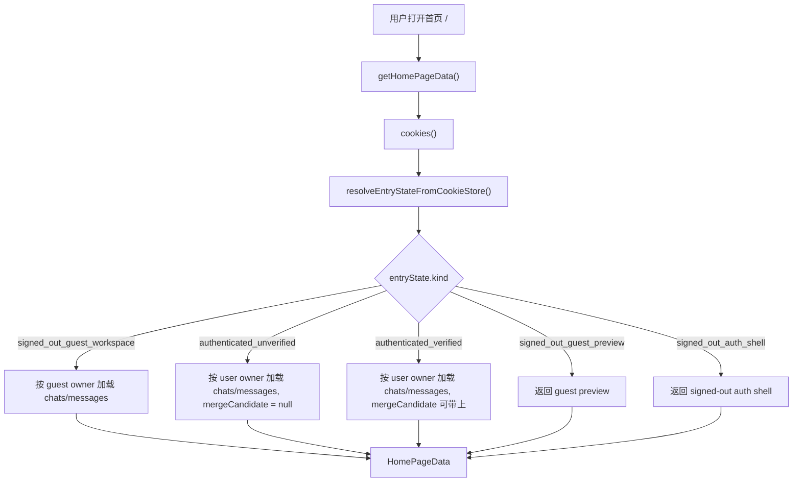
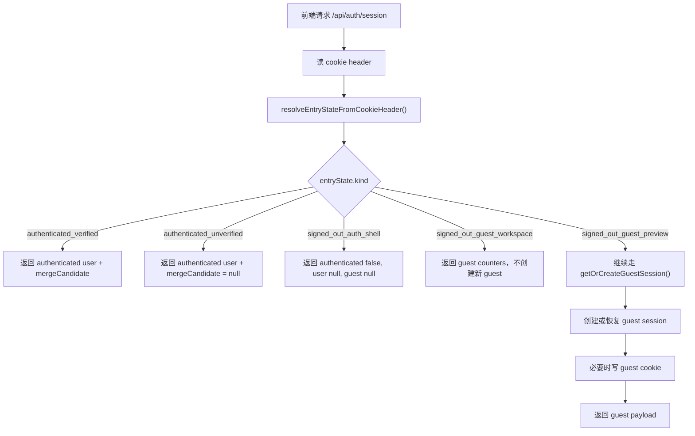

# Entry State And Page Protection 学习文档

## 这一个阶段到底解决了什么

这一阶段的目标，不是再加一个新的登录能力，也不是再补一个新的页面。

它真正解决的是：

> 系统第一次把“你现在该从哪个入口进入应用”正式收口成了一套共享服务端规则

在这次之前，项目其实已经有很多身份状态了：

- 未登录但可以 guest preview
- 未登录但有 guest workspace
- 未登录但被 auth-shell 引导回登录入口
- 已登录但邮箱未验证
- 已登录且邮箱已验证

问题不在于这些状态不存在，而在于：

- 首页 `/` 自己判断一套
- `/api/auth/session` 自己判断一套
- 前端再根据返回结果继续决定一套

也就是说，规则已经有了，但“入口状态”还没有被正式命名，也没有一个统一的服务端中心。

所以这一阶段补的是：

- 抽出 `src/server/auth/entry-state.ts`
- 把现有入口状态显式收口成 5 种
- 让首页 bootstrap 和 `/api/auth/session` 共用同一套入口判断
- 再顺手为未来 protected pages 预留 `authenticated` / `verified` 两种访问规则

这次最核心的变化不是“某个页面跳转了”，而是：

> 首页、session 接口、未来页面保护，第一次开始说同一种“入口语言”

---

## 这件事和“鉴权”到底是什么关系

这里最容易混的是：

- entry state
- authorization

它们不是同一个层次。

你可以这样记：

- entry state，解决的是“这个请求现在应该落到哪一种入口状态”
- authorization，解决的是“这个用户现在有没有权限执行某个动作”

所以这次做的不是把 route 里的鉴权全搬走，而是先把“入口判断”收口。

比如：

- `src/server/auth/entry-state.ts`
  负责判断你现在是 guest preview、guest workspace、auth shell、authenticated unverified，还是 authenticated verified
- `src/app/api/chat/route.ts`
  仍然要自己决定这次聊天请求能不能发、是不是 verified user、guest quota 有没有超
- `src/app/api/guest/merge/route.ts`
  仍然要自己决定这次 merge 能不能做

所以你可以记一句最实用的话：

> `entry-state` 负责入口分流，不负责替代动作级鉴权

---

## 明天建议你先看哪些文件

按这个顺序看最顺：

1. `src/server/auth/entry-state.ts`
2. `src/server/page/home-data.ts`
3. `src/app/api/auth/session/route.ts`
4. `src/server/auth/entry-state.test.ts`
5. `src/server/page/home-data.test.ts`
6. `src/app/api/auth/session/route.test.ts`
7. `docs/superpowers/specs/2026-04-10-entry-state-and-page-protection-design.md`

为什么这样看：

- 先看新的统一状态模块到底产出了什么
- 再看首页怎么消费它
- 再看 session route 怎么消费它
- 然后回头看测试，确认每种状态被怎么验证
- 最后再看设计文档，理解为什么这次故意没有直接上 `proxy.ts`

---

## 你先记住两个最重要的数据结构

## 1. `EntryState`

文件：`src/server/auth/entry-state.ts`

这次最关键的不是新增数据库字段，而是新增了一组显式状态：

```ts
type EntryStateKind =
  | "signed_out_guest_preview"
  | "signed_out_guest_workspace"
  | "signed_out_auth_shell"
  | "authenticated_unverified"
  | "authenticated_verified";
```

它的意义是：

- 不再让每个入口自己临时拼凑“当前是谁”
- 而是先由服务端统一解析成一种明确状态

你可以把它理解成：

> 服务器先给当前请求贴一个入口标签，后面的页面和 route 再决定怎么消费这个标签

这 5 种状态分别是：

1. `signed_out_guest_preview`
   没登录、没可恢复 guest、也没被 auth-shell 强制回登录入口。
2. `signed_out_guest_workspace`
   没登录，但当前浏览器里有仍然有效的 guest session。
3. `signed_out_auth_shell`
   没登录，但 `ai-chat-auth-shell=1`，所以优先显示登录 / 注册入口。
4. `authenticated_unverified`
   已登录，但邮箱还没验证。
5. `authenticated_verified`
   已登录，且邮箱已经验证。

你读代码时可以一直盯住一句话：

> 这里到底是在“解析入口状态”，还是在“消费入口状态”？

如果是在 `entry-state.ts`，那它就是前者。
如果是在 `home-data.ts` 或 `/api/auth/session`，那它就是后者。

## 2. `resolveProtectedPageAccess`

文件：`src/server/auth/entry-state.ts`

这次另一个很关键的小接口是：

- `resolveProtectedPageAccess(state, requirement)`

它现在主要回答两种问题：

- 这个页面是不是要求 `authenticated`
- 这个页面是不是要求 `verified`

它当前并没有直接接到真实 protected page 上，但它的价值在于：

- 以后新增 `/account`
- 或者新增 `/settings`
- 或者新增真正的 `/workspace`

这些页面就不需要再重新查 cookie、重新拼一套状态判断了。

你可以把它理解成：

> 这次先把“以后页面保护该怎么问入口状态”这件事约定好

---

## 为什么首页 `/` 和 `/api/auth/session` 现在看起来很像，但又不能完全一样

这是这次最容易绕的点。

表面上看：

- 首页 `/` 要知道当前用户处于哪种入口状态
- `/api/auth/session` 也要知道当前用户处于哪种入口状态

所以它们都改成先调：

- `resolveEntryStateFromCookieStore`
- 或 `resolveEntryStateFromCookieHeader`

但这两个入口还是有一个关键差异：

### 首页 `/` 是只读入口

也就是：

- 没有 guest cookie
- 或 guest 已过期
- 或 guest 已 merged

首页都只会回：

- `signed_out_guest_preview`

它不会顺手再帮你创建一条新的 guest session。

为什么这样：

- 首页是 bootstrap 页面
- 它现在的产品策略是“先预览，再按需要激活”
- 所以它不应该只因为你访问了 `/`，就偷偷创建 guest 身份

### `/api/auth/session` 是可激活入口

而这个接口的职责不同。

它的作用更像：

> 把服务端真实 cookie 状态，翻译成前端当前应该用的身份状态；如果现在是 preview 且前端确实来拿 session，就允许顺手激活 guest

所以它现在的顺序是：

1. 先用 `entry-state` 判断当前属于哪种入口状态
2. 如果已经是：
   - authenticated verified
   - authenticated unverified
   - signed-out auth shell
   - signed-out guest workspace
   那就直接翻译成 response
3. 只有当它是：
   - `signed_out_guest_preview`
   才会继续走 `getOrCreateGuestSession()`

你可以把它理解成：

> 首页负责看清楚你在哪个入口；session route 则是在某些入口下，允许真的把 guest 身份“开起来”

---

## 调用流程 1：首页 `/` 现在怎么决定首屏



这里最重要的一点是：

- 首页不再自己拆 session / guest / auth-shell 三套判断
- 而是先拿一个统一的 `entryState`
- 再把这个状态翻译成 `HomePageData`

所以现在 `home-data.ts` 更像是：

> 一个“入口状态翻译器”，而不是一个“入口状态推理器”

---

## 调用流程 2：`/api/auth/session` 现在怎么工作



这里真正要盯住的顺序是：

### 顺序 1：先解析 entry state，再决定要不要激活 guest

这次之前，session route 里是自己边读 cookie 边判断。

这次之后变成：

1. 先 `resolveEntryStateFromCookieHeader()`
2. 再根据不同状态翻译 response
3. 只有 preview 才继续 guest activation

### 顺序 2：`signed_out_guest_preview` 才允许落到 `getOrCreateGuestSession()`

这个边界非常关键。

因为如果你把最后的 default 分支也当成 preview：

- 今天也许还能工作
- 但明天只要多加第 6 种状态
- route 就可能悄悄走错到“创建 guest session”

所以现在 route 已经改成了穷尽匹配：

> 只有明确的 `signed_out_guest_preview` 分支，才允许创建或恢复 guest session

---

## `entry-state` 为什么故意不抛很多业务错误

这一点也很重要。

入口状态层现在更像“降级层”，而不是“错误层”。

比如：

- guest token 不存在
- guest 已过期
- guest 已 merged

这些情况在入口解析里都不会报 401 / 403，
而是会自然降级成：

- `signed_out_guest_preview`

为什么要这样：

- 这些情况对首页来说，不是动作错误
- 而只是“当前已经没有可恢复 guest 了”
- 所以更合理的是回一种可消费状态，而不是把页面打成异常

真正该抛错误的地方还是：

- `/api/chat`
- `/api/guest/merge`
- 以后真实受保护的 mutation route

你可以记一句：

> `entry-state` 更关心“你现在该进入哪里”，而不是“你刚刚是不是犯错了”

---

## 这件事和 Next.js 16 的 `proxy` 到底是什么关系

这次设计和实现里有一个故意的选择：

- 没有直接上 `proxy.ts`

原因不是忘了，而是有意为之。

因为 Next.js 16 已经明确：

- 以前的 `middleware` 现在叫 `proxy`
- 它更适合做轻量 redirect / rewrite / header 处理
- 不适合背完整 session management / authorization

所以这次真正先做的，是把：

- 状态解析
- 页面入口
- session 接口

这三件事先统一。

这样以后如果你真的加 `proxy.ts`，它也只会负责：

- 未登录时该不该跳转
- 已登录未验证时该不该挡某些页面

而不会去背“真正的动作级鉴权”。

这就是现在这套设计的真正意义：

> 先把入口语言统一，再考虑要不要给某些页面加前置跳转层

---

## 明天如果你继续看，最值得问自己的 5 个问题

1. `entry-state.ts` 里到底哪些逻辑是在“解析状态”，哪些逻辑不应该出现在这里？
2. 为什么首页 `/` 和 `/api/auth/session` 都用同一个 `entryState`，但只有后者能创建 guest session？
3. `authenticated_unverified` 和 `authenticated_verified` 这两个状态，最大的业务差异到底是什么？
4. 如果未来多加一种入口状态，哪些消费方会被 TypeScript 提醒你还没处理？
5. `resolveProtectedPageAccess()` 现在虽然还没接真实页面，但它已经替未来约定了什么？

---

## 一句话总结

这次不是新加一个身份系统，而是把项目里已经存在的 5 种身份入口，第一次正式收口成一个共享服务端模块，让首页、session 接口和未来页面保护开始共用同一套入口判断。
